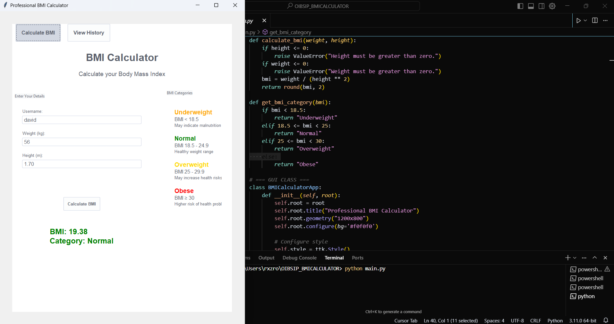
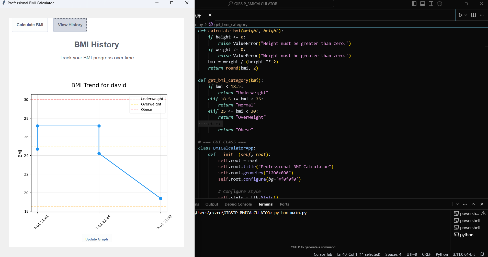

# BMI Calculator

A robust, modern BMI (Body Mass Index) Calculator application built with Python, Tkinter, SQLite, and Matplotlib. This project provides a clean, responsive interface for calculating BMI, visualizing trends, and securely storing user data locally.

---

## 📸 Screenshot






---

## Overview
This application enables users to:
- Calculate BMI instantly from height and weight inputs
- View BMI category with color-coded feedback
- Track BMI history and visualize trends over time
- Store all data locally for privacy and offline access

The codebase is modular and easy to extend, making it suitable for further development or integration into larger health-related projects.

---

## Features
- **Modern UI:** Two-column, card-based layout with responsive design
- **Real-Time Calculation:** Instant BMI computation and feedback
- **Color-Coded Results:** Semantic colors for BMI categories
- **BMI History:** Persistent storage and visual trend graph (Matplotlib)
- **Local Database:** Secure, private data storage using SQLite
- **Extensible Codebase:** Modular structure for easy maintenance and enhancement

---

## Technology Stack
- **Python 3.7+**
- **Tkinter** (GUI)
- **SQLite** (local database)
- **Matplotlib** (data visualization)

---

## Installation
Clone the repository and install dependencies:
```bash
git clone <https://github.com/ROSHNIFATIMA/OIBSIP_BMICALCULATOR.git>
cd OIBSIP_BMICALCALCULATOR
pip install -r requirements.txt
```

---

## Usage
Run the application:
```bash
python main.py
```

**How to use:**
1. Enter height (cm) and weight (kg)
2. Click **Calculate BMI**
3. Instantly view your BMI, category, and trend graph

---

## Project Structure
```
main.py        # Main application: UI, logic, event handling
database.py    # Database management: SQLite operations
requirements.txt # Python dependencies
```

- **main.py:** Contains the Tkinter UI, BMI calculation logic, event handling, and graph integration.
- **database.py:** Handles all database CRUD operations for BMI records.
- **requirements.txt:** Lists all required Python packages.

---

## Contributing
Contributions are welcome! To add features or fix bugs:
1. Fork the repository
2. Create a new branch
3. Make your changes with clear, documented code
4. Submit a pull request

---


© BMI Calculator - Developed as part of an internship program 

